# KGL Management System
Role-based inventory, procurement, sales, and credit management platform for **Karibu Groceries Ltd (KGL)**.

## Overview
KGL Management System digitizes branch operations that were previously tracked in manual record books.  
It supports two branches, role-specific workflows, and director-level visibility across the business.

### Branches
- Maganjo
- Matugga

### Roles
- `Director`: global reports, branch control, user management
- `Manager`: procurement, stock, sales, branch-level operations
- `SalesAgent`: sales and credit operations

## What This Solves

- Centralizes procurement, stock, sales, and credit records
- Enforces role-based and branch-based access controls
- Prevents invalid transactions through backend validation
- Keeps director reporting accurate with real-time aggregates

## Key Features

### Authentication and Access Control
- JWT-based login and registration
- Role authorization middleware (`Director`, `Manager`, `SalesAgent`)
- Branch assignment required for non-director login
- User activation/deactivation controls

### Branch and User Administration (Director)
- Branch CRUD with protection rules for core branches
- User CRUD with activation controls
- Branch assignment constraints:
  - Maximum `1 Manager` per branch
  - Maximum `2 SalesAgent` per branch

### Procurement and Stock
- Procurement recording with source, quantity, pricing, and metadata
- Automatic stock increment on procurement
- Stock CRUD with reconciliation on update/delete
- Stock uniqueness per `produce + branch`

### Sales and Credit
- Cash sales workflows with stock deduction
- Credit sales with due date, customer details, and payment tracking
- Partial/full repayment handling
- Protection against over-selling and invalid payment values
- Sales update/delete ownership: only the recorder can manage their own sale entries

### Reporting
- Director summary cards (`total sales`, `credit`, `stock`, `today sales`, `pending credit`)
- Director analytics/report endpoints
- Branch overview endpoint for manager/sales agent dashboards

## Business Rules Implemented

- Sales and credit cannot exceed available stock
- Procurement increases stock
- Sales and credit dispatch decrease stock
- Stock edits/deletes are reconciled safely
- Allowed produce is standardized and validated
- Branch values are controlled (`maganjo`, `matugga`)
- Protected account and branch rules are enforced in admin logic
- Sales entry ownership is enforced on backend and UI:
  - A user can update/delete only sales they recorded
  - Sales Agent dashboard (`sales.html`) is restricted to `SalesAgent` accounts
  - Manager sales operations are done from `manager.html`

## Tech Stack

- Frontend: HTML, CSS, Vanilla JavaScript
- Backend: Node.js, Express
- Database: MongoDB + Mongoose
- Security: JWT + role middleware
- Validation: `express-validator`
- Logging: Winston

## Project Structure

```text
KGL-MANAGEMENT/
  backend/
    src/
      controllers/
      middleware/
      models/
      routes/
      utils/
      validation/
    package.json
  frontend/
    *.html
    css/
    js/
    images/
  README.md
```

## Local Setup

### 1. Prerequisites

- Node.js 18+
- MongoDB 

### 2. Backend

```bash
cd backend
npm install
```

Create `backend/.env`:

```env
PORT=5000
MONGO_URI=mongodb://127.0.0.1:27017/kgl
JWT_SECRET=replace_with_secure_secret
JWT_EXPIRE=30d
CLIENT_URL=http://127.0.0.1:5500
NODE_ENV=development
```

Run server:

```bash
npm run dev
```

Health check:

- `GET http://localhost:5000/api/test`

### 3. Frontend

Option A (recommended): use the backend to serve frontend files:

```bash
cd backend
npm run dev
```

Open:

- `http://localhost:5000/login.html`

Option B (separate static server during local development):

```bash
npx serve frontend
```

Open:

- `http://localhost:<port>/login.html`

## Render Deployment (Single Service)

This repo includes `render.yaml` for deploying backend + frontend together as one Node web service.

1. Push repo to GitHub.
2. In Render, create a new Blueprint from the repo.
3. Set required secret env vars in Render:
   - `MONGO_URI`
   - `JWT_SECRET`
   - `CLIENT_URL`
   - `ALLOWED_ORIGINS`
4. Deploy and open:
   - `https://<your-service>.onrender.com/login.html`

## API Route Summary

### Public
- `POST /api/auth/register`
- `POST /api/auth/login`

### Director Only
- `GET /api/reports/summary`
- `GET /api/reports`
- `/api/director/users` (management routes)
- `/api/branches` (management routes)

### Manager Only
- `/api/procurement` (CRUD)
- `/api/stock` (CRUD)

### Manager + SalesAgent
- `/api/sales` (CRUD)
- `/api/credit` (CRUD)
- `POST /api/credit/:id/pay`
- `GET /api/reports/branch-overview`

## Screenshots

### Login


### Director
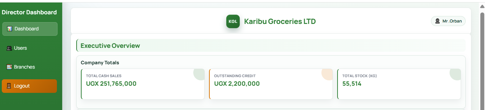
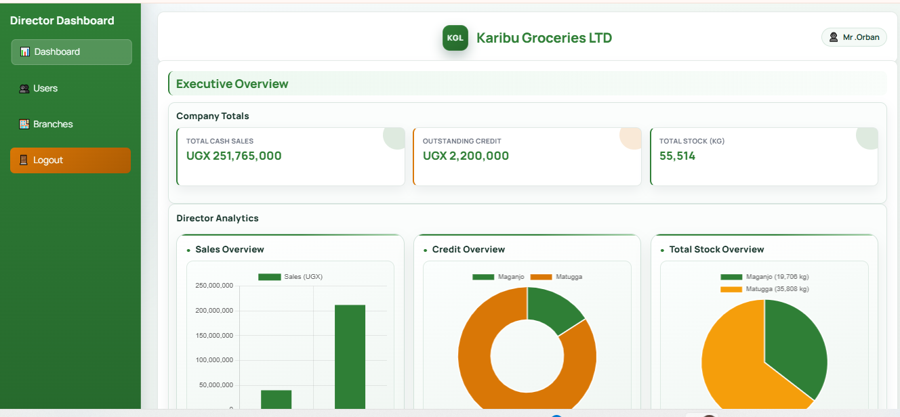
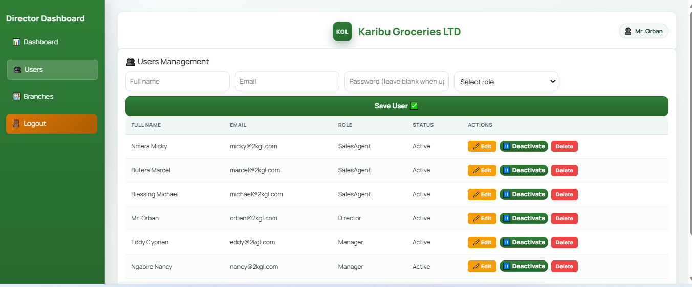
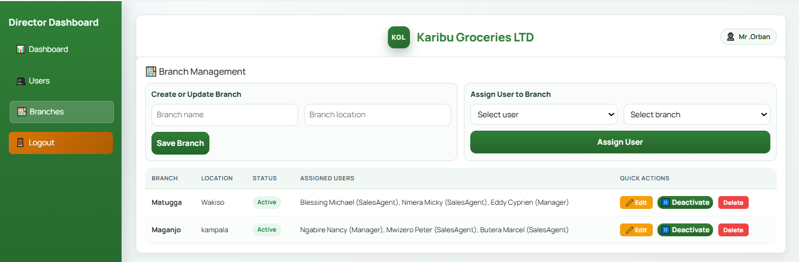

### Manager - Maganjo
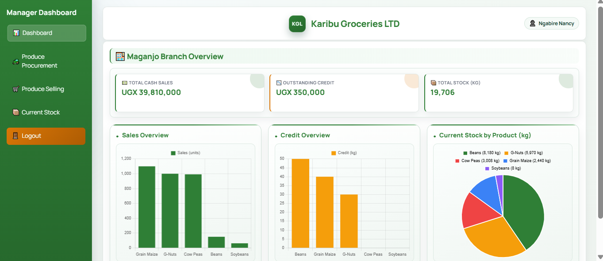
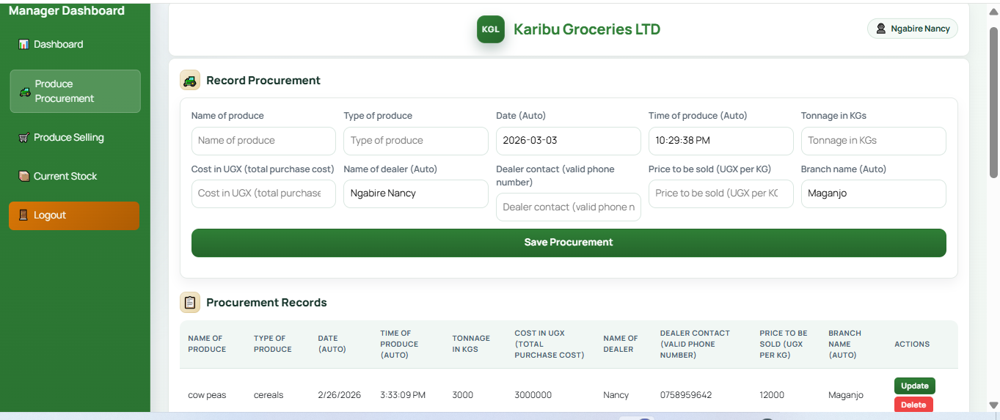
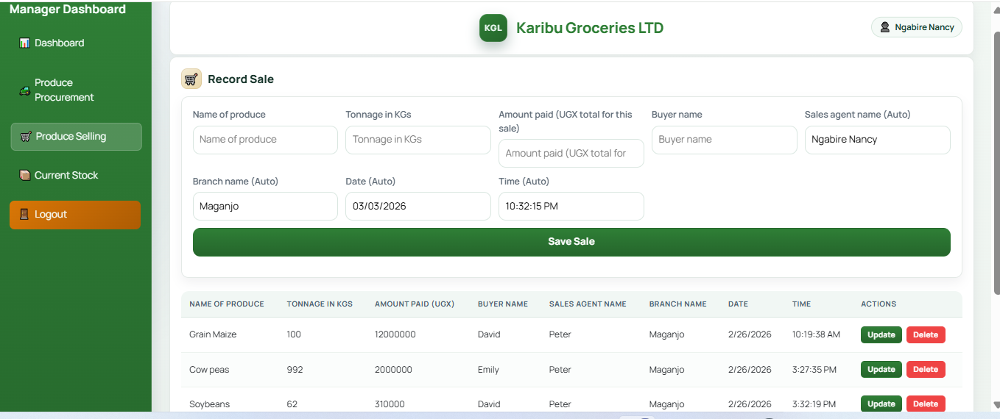
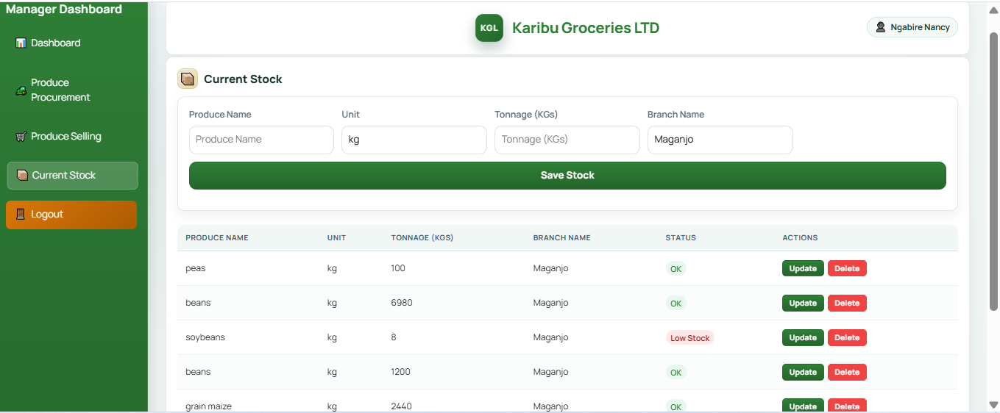

### Sales Agent - Maganjo
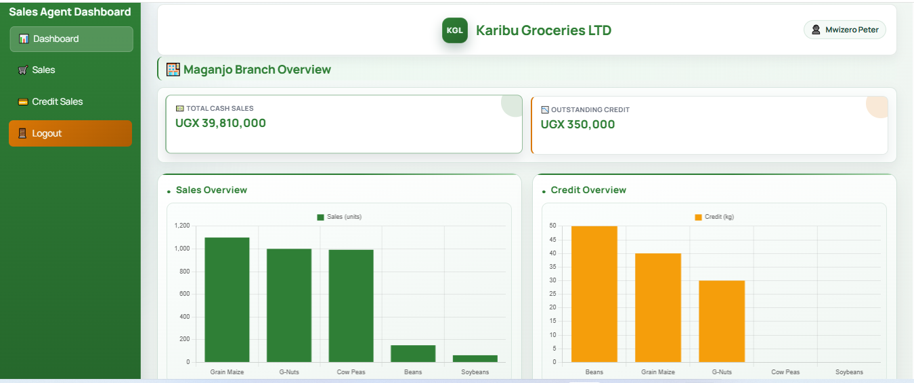
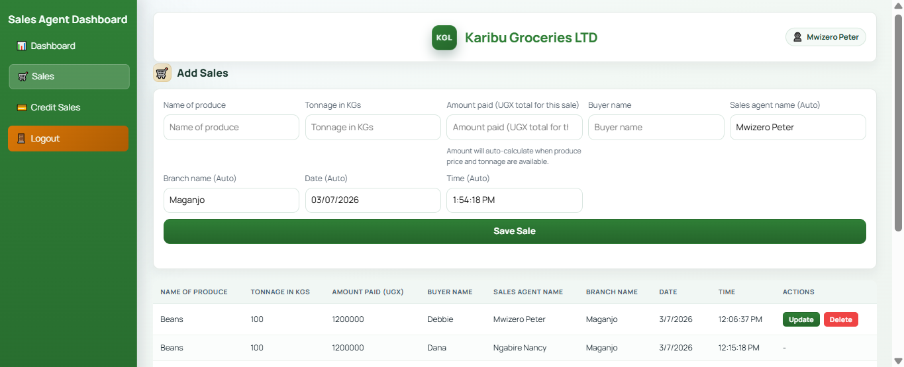
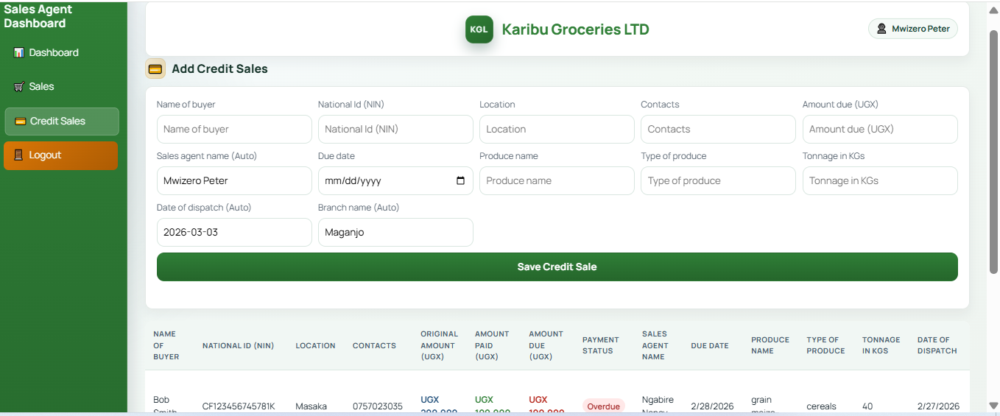

### Manager - Matugga
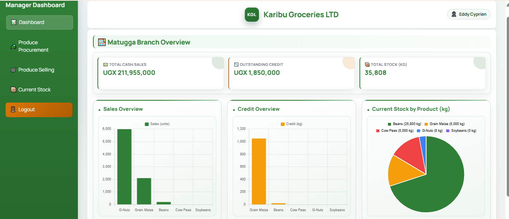
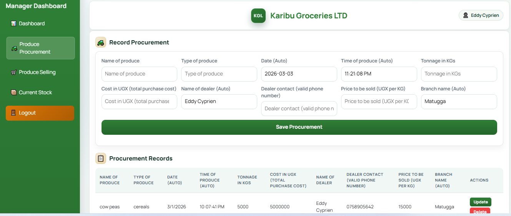
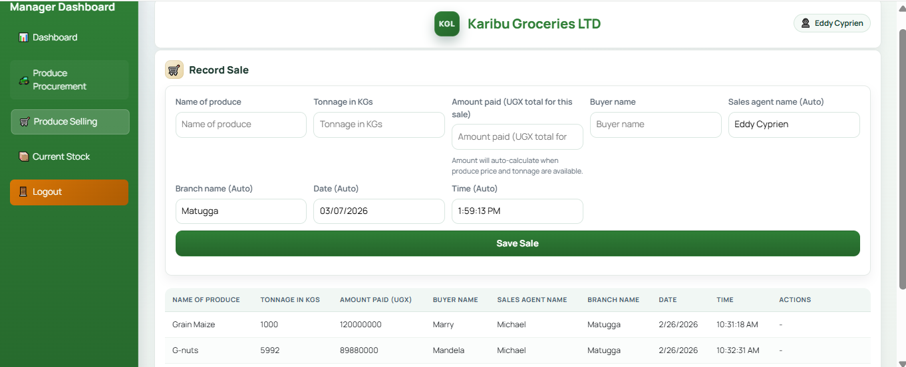
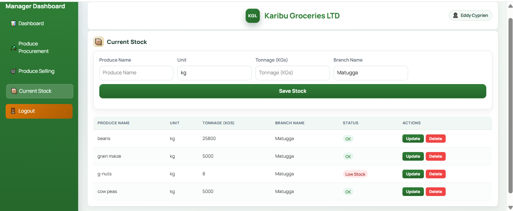

### Sales Agent - Matugga
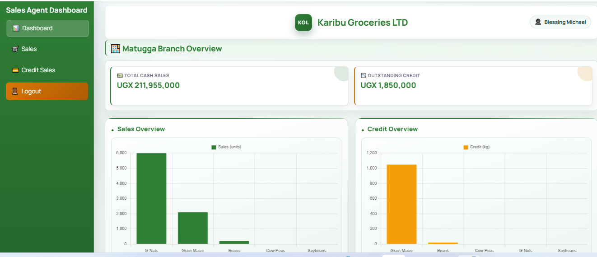
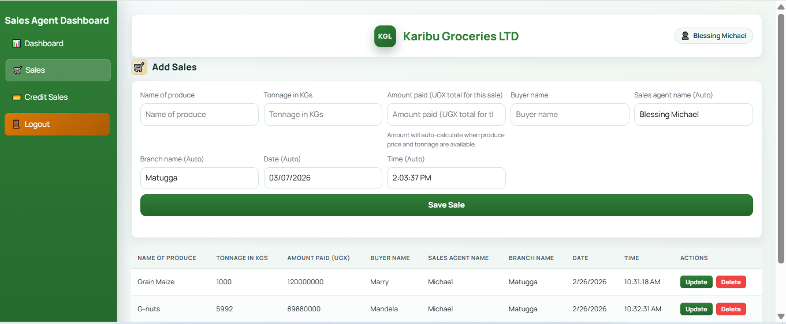
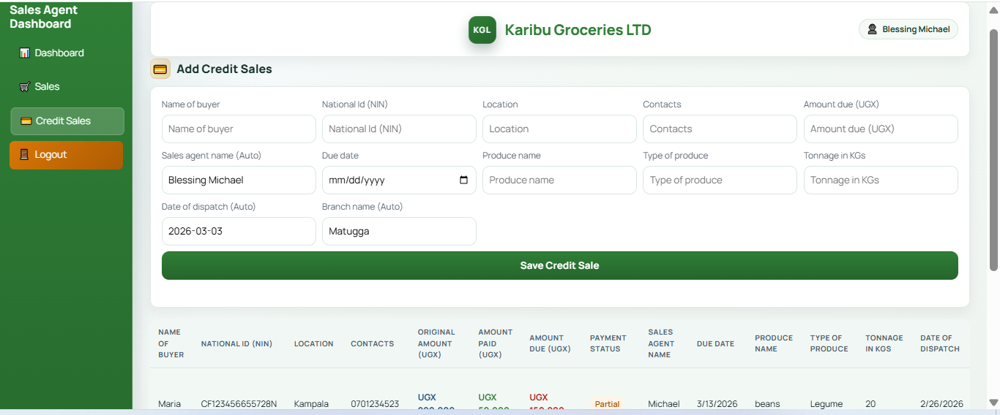
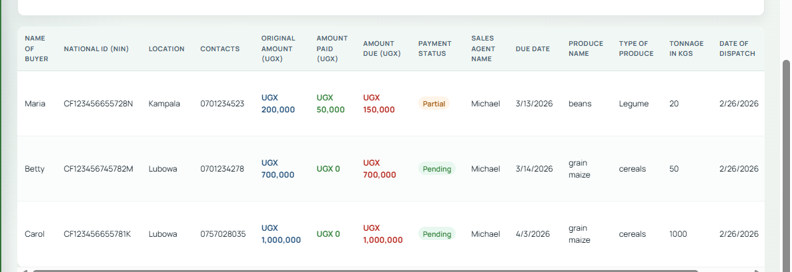
